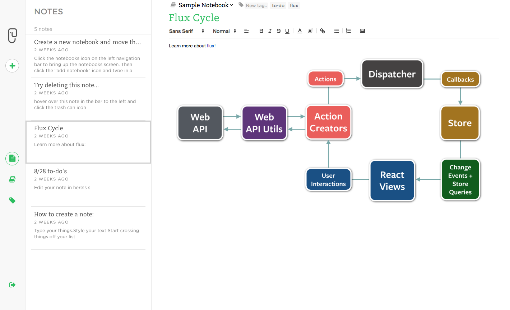
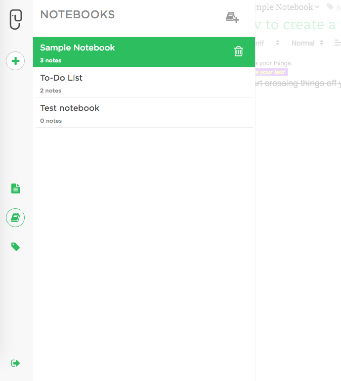

# QUICKNOTE

[Quicknote live] (https://quickernote.herokuapp.com/)

Quicknote is a full-stack, single page web app inspired by Evernote. It's built on a Ruby on Rails backend, uses a Puma web server and PostgreSQL database, and features a React.js frontend utilizing the Flux architectural framework.

Quicknote's UI is based directly on Evernote's for a professional look and a quick, intuitive experience.



## IMPLEMENTATION

### Single-Page App
Quicknote renders content by making background API calls (via Ajax) to the database. Using jBuilder, content is formatted into clean JSON objects before being passed to the frontend React components.

### Flux Architecture
Uses stores to hold notes, notebooks, tags, and the current user (session) for a single source of truth on the frontend, and utilizes a Dispatcher to create a uni-directional flow of data, ensuring only accurate information is read and updated in the components.

## FEATURES

### Notes
Notes are stored in one table in the database using the following columns: notebook_id, body, title. They're passed to the 'notes store' via an API call on login, and removed from the store on logout. API calls are made in the background throughout a session as notes are created and updated to maintain consistency between the database and the store.

### Notebooks
Notebooks are stored and saved similar to notes, with their database table containing the following info: title, user_id. Notebooks can be deleted and created via a notebooks drawer, and can be edited once selected.



### Tags
Tags are stored in the database with a title and user_id. Quicknote uses a join model "taggings" and Active Record's has_many_through relationship to establish a connection between notes and tags.

```ruby
class Tagging < ApplicationRecord
  belongs_to :tag, inverse_of: :taggings
  belongs_to :note

  validates :tag_id, uniqueness: { scope: :note_id }
end

class Tag < ApplicationRecord
  validates :title, presence: true

  has_many :taggings, dependent: :destroy
  has_many :notes, through: :taggings
  has_many :notebooks, through: :notes
  belongs_to :user
end

class Note < ApplicationRecord
  validates :notebook_id, presence: true

  has_many :taggings, dependent: :destroy
  has_many :tags, through: :taggings
end
```

Further, all foreign keys are indexed, allowing for lightning quick lookups.

### Rich-Text Editing
Quicknote uses the Quill.js library to edit notes, allowing for an intuitive, Word-processor like user-experience.

### Auto-Save
Notes are saved to the database as they're edited via background API calls, ensuring a great user experience (content is never lost, and you never have to worry about saving).

## ROADMAP
### Search
Make users, notes, notebooks, and tags searchable.

### Reminders and due dates
Allow users to schedule note due dates and reminders that will
sync to their Google Calendars.

### Cross-account collaboration
Allow multiple users to collaborate on notebooks and notes.
